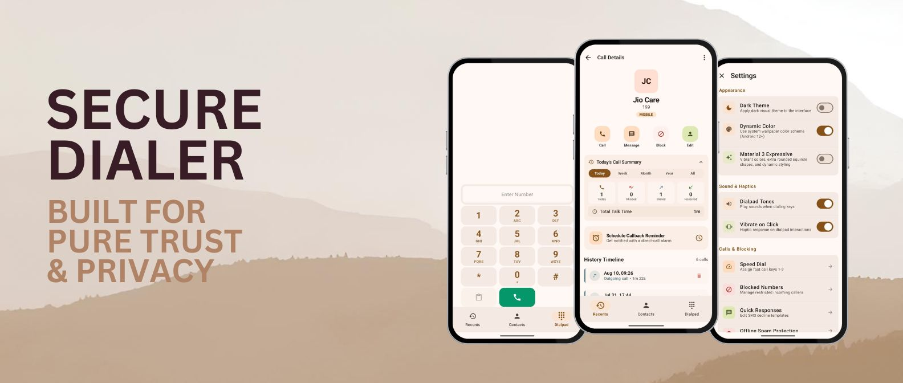
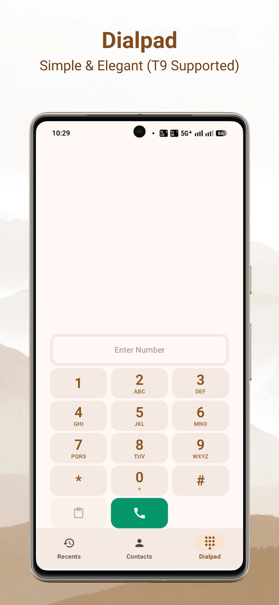
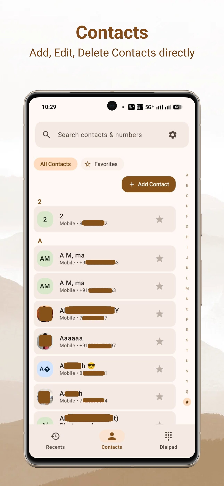
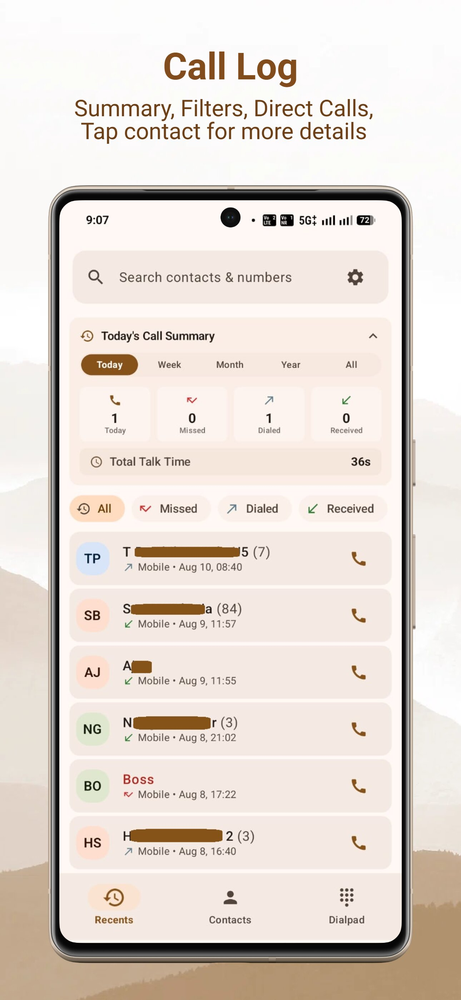
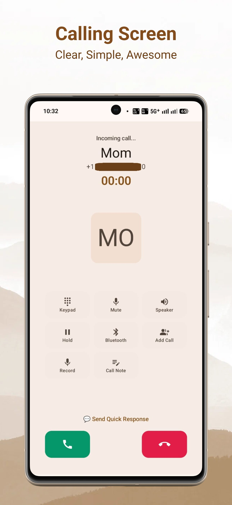
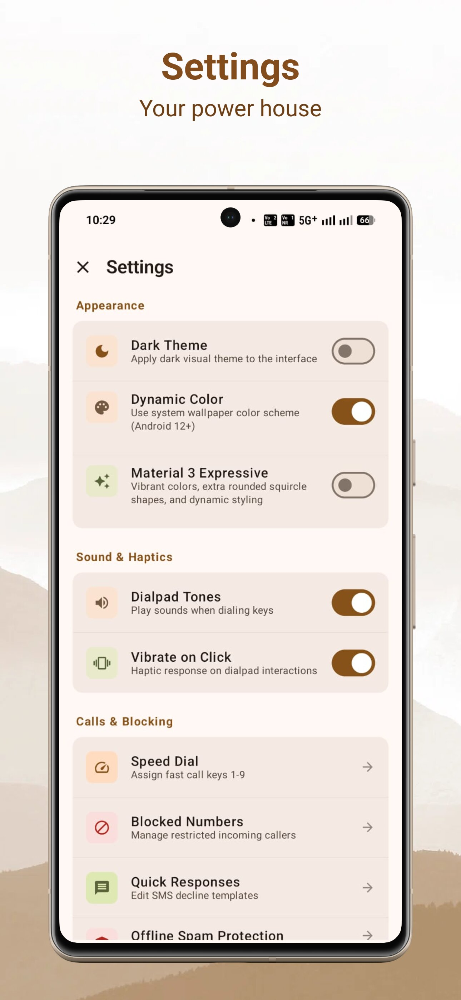

# Secure Dialer  — Pure, Private, Lightweight & Offline FOSS Google Dialer Alternative

<p align="center">
  <a href="https://github.com/Secure-Phone-apps/Secure-Dialer/stargazers"></a>
  <a href="https://github.com/Secure-Phone-apps/Secure-Dialer/releases"></a>
  <a href="https://github.com/Secure-Phone-apps/Secure-Dialer/actions/workflows/ci.yml"></a>
  <a href="https://github.com/Secure-Phone-apps/Secure-Dialer/releases"></a>
  <a href="https://developer.android.com/about/versions/nougat/android-7.0"></a>
  <a href="https://kotlinlang.org/"></a>
  <a href="https://developer.android.com/develop/ui/compose"></a>
  <a href="https://github.com/Secure-Phone-apps/Secure-Dialer"></a>
  <a href="https://github.com/Secure-Phone-apps/Secure-Dialer"></a>
  <a href="https://github.com/Secure-Phone-apps/Secure-Dialer/blob/main/LICENSE"></a>
  <a href="https://apps.obtainium.imranr.dev/redirect?r=obtainium%3A%2F%2Fadd%2Fhttps%3A%2F%2Fgithub.com%2FSecure-Phone-apps%2FSecure-Dialer"></a>
  <a href="https://github.com/Secure-Phone-apps/Secure-Dialer/discussions"></a>
  <a href="https://github.com/sponsors/Secure-Phone-apps"></a>
</p>

<p align="center">
  <a href="https://apps.obtainium.imranr.dev/redirect?r=obtainium%3A%2F%2Fadd%2Fhttps%3A%2F%2Fgithub.com%2FSecure-Phone-apps%2FSecure-Dialer">
    
  </a>
</p>

<p align="center">
  <a href="#manifesto"><b>Manifesto</b></a> •
  <a href="#protection-matrix"><b>Protection Matrix</b></a> •
  <a href="#permissions"><b>Permissions</b></a> •
  <a href="#guidelines"><b>Guidelines</b></a> •
  <a href="#faq"><b>FAQ</b></a> •
  <a href="#download"><b>Download</b></a> •
  <a href="#translations"><b>Translations</b></a> •
  <a href="#source"><b>Source</b></a>
</p>



<p align="center">
  
  
  
</p>
<p align="center">
  
  
  
</p>

> [!IMPORTANT]
> ###  The Secure Dialer Zero-Trust Privacy Commitment
> * **Zero Network Sockets:** The `INTERNET` permission is physically removed from our Android manifest. The Android operating system enforces that this app cannot open a single network socket or communicate with any cloud server.
> * **Hardware-Backed Cryptography:** Call notes, blocklists, and settings are encrypted on-device via AES-256 SQLCipher with keys derived from your phone's hardware security module (Android KeyStore / StrongBox).
> * **Zero Trackers & Zero Ads:** Completely free of Google Firebase, analytics frameworks, advertising SDKs, and third-party trackers.
> * **Verifiable Open Source:** Licensed under GNU GPLv3. Every byte of source code is public, auditable, and reproducible.

```text
┌──────────────────────────────────────────────────────────┐
│                   Android OS Framework                   │
└────────────────────────────┬─────────────────────────────┘
                             │ (Native InCall IPC)
┌────────────────────────────▼─────────────────────────────┐
│             MyInCallService : InCallService              │
└────────────────────────────┬─────────────────────────────┘
                             │
       ┌─────────────────────┼─────────────────────┐
       ▼                     ▼                     ▼
┌──────────────┐     ┌──────────────┐     ┌──────────────────┐
│  Dialer Repo │     │ Room SQLite  │     │ Android KeyStore │
│ (T9 Search)  │     │ (SQLCipher)  │     │ (Hardware Root)  │
└──────────────┘     └──────────────┘     └──────────────────┘
```

---

<a id="manifesto"></a>
##  Why Your Privacy Matters to Me

Your phone dialer is not just another app—it is the direct gateway to your life's most intimate, private moments. It connects you to your family, your doctor, confidential legal matters, work conversations, and late-night calls with loved ones.

In today's commercial software ecosystem, most stock dialers and commercial caller ID apps harvest your address book, log your metadata, upload your contact graphs to remote servers, and monetize your relationships through targeted ads.

I built **Secure Dialer** with a simple, uncompromising conviction: **your phone calls belong to you and the person on the other end of the line—nobody else.** 

I wanted an app that is:
* **Honest and respectful:** No cloud logins, no forced permissions, no artificial telemetry.
* **Modern and tactile:** Powered by Material 3 Expressive spring physics, adaptive dynamic colors, and fluid 120Hz frame pacing.
* **Dependable on every device:** Built with defensive, offline-first architecture that runs smoothly on the latest Android 15/16 flagships, de-Googled custom ROMs (GrapheneOS, LineageOS, CalyxOS), and legacy phones alike.

---

##  Quick Comparison: Secure Dialer vs Other Options

| Feature / Security Point | **Secure Dialer (FOSS)** | **Google / Samsung Dialer** | **Commercial Caller ID** | **Other Open-Source** |
| :--- | :---: | :---: | :---: | :---: |
| **100% Free & Open Source (GPLv3)** | **Yes** | No (Closed source) | No (Closed source) | Yes |
| **Zero Internet Permission** | **Yes (100% Offline)** | No (Background telemetry) | No (Uploads contacts) | Yes |
| **Local Offline Spam Screening** | **Yes (CallScreeningService)** | Needs Cloud Sync | Needs Cloud & Upload | Limited |
| **On-Device Database Encryption** | **Yes (SQLCipher AES-256)** | Plaintext SQLite | Stored on Cloud Servers | Plaintext SQLite |
| **Hardware Key Protection** | **Yes (Android KeyStore)** | No | No | No |
| **Outgoing Caller ID (CLIR) Masking** | **Yes (Carrier Codes + Bypass)**| Basic | Cloud-dependent | Limited |
| **Biometric App & Recording Vault** | **Yes (BiometricPrompt)** | No | No | No |
| **Local Call Recording Engine** | **Yes (Offline M4A + Scrubber)**| Restricted / Cloud | Uploads / Ads | Basic |
| **Conference & Waiting Call Control** | **Yes (Multi-line Merge)** | Yes | Yes | Limited |
| **Material 3 Expressive UI** | **Yes (Jetpack Compose)** | Stock Material | Cluttered / Ads | Classic M2 / M3 |
| **Works on Older & Newer Phones** | **Yes (API 24 to 36)** | OEM Restricted | Heavy resource usage | Yes |

---

<a id="protection-matrix"></a>
##  Core Capabilities & Protection Matrix

| Capability | How It Works Under the Hood | How It Protects You |
| :--- | :--- | :--- |
| **Outgoing Caller ID (CLIR)** | Automatically formats carrier MMI codes (`#31#`, `*67`, etc.) before passing to baseband. Includes direct shortcut to system SIM hardware accounts. | Shields your private phone number from unknown businesses or service providers when making outgoing calls. |
| **Biometric App Lock & Shield** | Hardware-authenticated `BiometricPrompt` keyguard. In release builds, `FLAG_SECURE` blocks screen capture and recents overview. | Prevents friends, family, or strangers from snooping through your call history or reading private contact notes. |
| **Offline Call Recording** | Multi-tier audio fallback (`VOICE_RECOGNITION` $\rightarrow$ `MIC` $\rightarrow$ `VOICE_COMMUNICATION` $\rightarrow$ `DEFAULT`) saving high-clarity AAC/M4A locally. | Keeps sensitive business and legal audio records completely on-device without third-party cloud listeners. |
| **Self-Healing Recording Vault** | Optional biometric lock on recording playback with variable speed scrubbing and automatic recovery of orphaned files on disk. | Protects recorded audio from unauthorized playback and guarantees zero dropped recordings after abrupt power cuts. |
| **Offline Spam Screening** | Native Android `CallScreeningService` evaluates incoming numbers locally against encrypted blocklists in under 5ms. | Blocks annoying robocalls, telemarketers, and hidden numbers without sending your address book to a server. |
| **Emergency Safety Override** | Hardware baseband check detects emergency numbers (`911`, `112`, `999`, etc.) and automatically bypasses CLIR masking. | Guarantees that urgent emergency calls are never withheld and always transmit location telemetry to first responders. |
| **Conference & Waiting Calls** | Multi-line call merging (`Call.conference()`), line swapping, and non-intrusive call waiting alerts. | Provides seamless business and multi-party calling capabilities without commercial telephony subscriptions. |
| **Smart T9 Predictive Dialpad** | Instant on-device index matching names and numbers as you tap digits; supports dual-SIM account selection per call. | Allows rapid dialing in milliseconds without cloud search requests or lag. |
| **Dynamic Island & Floating Pill** | Minimized floating overlay status indicator when navigating outside active calls; includes speaker-only toggle. | Keep track of ongoing call duration and audio state while multitasking in other apps. |
| **Pocket Protection & Gestures** | Proximity sensor detects pocket placement to disable accidental touches; flip phone face-down to silence ringers. | Eliminates accidental face hangups and prevents loud ring interruptions during meetings. |
| **AMOLED True Black & Themes** | Pure `#000000` surface themes, customizable avatar shapes (Squircle, Hexagon, Rounded Square), and custom tab ordering. | Maximizes OLED battery life and tailors the calling interface to your aesthetic workflow. |

---

<a id="permissions"></a>
##  Android Permissions & Operational Rationale

To operate as your phone's **Default Dialer & InCallService**, Android requires standard telephony permissions. Because Secure Dialer has **zero internet permission**, your data physically cannot leave your phone:

| Permission | What It Does | Why It Is Safe |
| :--- | :--- | :--- |
| **`READ_CONTACTS`** | Powers the predictive T9 dialpad search and contacts tab. | Read strictly on-device; never uploaded or synced. |
| **`WRITE_CONTACTS`** | Adds, edits, or deletes contacts within the app. | Modifies your local address book only. |
| **`CALL_PHONE`** | Connects phone calls when tapping numbers or speed dials. | Passes calls directly to your SIM carrier. |
| **`READ_CALL_LOG`** | Displays incoming, outgoing, and missed call logs. | Kept strictly on-device. |
| **`WRITE_CALL_LOG`** | Clears call logs or removes specific entries. | Modifies local logs on your device only. |
| **`RECORD_AUDIO`** | Captures audio for user-initiated call recordings. | Microphone is accessed locally during calls; never streamed. |
| **`MODIFY_AUDIO_SETTINGS`**| Routes audio between earpiece, speakerphone, and Bluetooth. | Standard audio routing for voice calls. |
| **`USE_FULL_SCREEN_INTENT`**| Wakes the screen and displays incoming call alerts over lockscreen. | Ensures incoming calls ring cleanly and visibly. |
| **`POST_NOTIFICATIONS`**| Shows ongoing call controls and missed call badges in status bar. | Local system notifications only. |
| **`SYSTEM_ALERT_WINDOW`**| Renders the minimized in-call pill / Dynamic Island overlay. | Enables floating call controls while using other apps. |
| **`WAKE_LOCK`** | Powers the proximity sensor to turn screen off near your ear. | Prevents accidental face touches during calls. |
| **`DISABLE_KEYGUARD`** | Enables answering incoming calls directly over the lockscreen. | Answers calls without unlocking the keyguard first. |
| **`VIBRATE`** | Provides tactile feedback for keypad taps and call actions. | Hardware haptics only. |

> [!NOTE]
> **SMS Permission Notice:** Secure Dialer intentionally avoids requesting the dangerous `SEND_SMS` permission. Quick decline text messages are handed off through Android's standard system messaging app chooser, preserving strict least-privilege principles.

---

<a id="guidelines"></a>
##  Important Guidelines & Disclaimers

> [!WARNING]
> ### 1. Call Recording Legal Compliance
> Telephony recording laws vary significantly worldwide (including one-party vs. two-party / all-party consent laws in jurisdictions like California or Germany). You are solely responsible for ensuring you comply with all local statutes and disclosure requirements before initiating call recordings.

> [!IMPORTANT]
> ### 2. Emergency Calling Priority (911 / 112 / 999)
> Emergency services calls are afforded absolute priority by the Android Telecom subsystem. Secure Dialer automatically strips any Caller ID withholding prefixes (`CLIR`) on emergency calls and passes them unmodified to the baseband radio to guarantee that location and subscriber telemetry reach first responders without delay.

> [!CAUTION]
> ### 3. Zero-Knowledge Cryptographic Recovery
> Local database encryption (SQLCipher AES-256) and encrypted `.enc` configuration archives utilize industry-standard cryptographic algorithms without backdoors or recovery escrow. If you assign and subsequently forget an encryption password, the data cannot be decrypted or recovered.

> [!NOTE]
> ### 4. Carrier CLIR Network Limitations
> While Secure Dialer prepends standard 3GPP carrier MMI prefixes (`#31#`, `*67`, etc.) to suppress outgoing caller ID, your specific mobile operator or roaming agreement may enforce account-level rules governing whether private numbers are permitted on the cellular network.

---

<a id="faq"></a>
##  Frequently Asked Questions (FAQ)

<details>
<summary><b>Why does Android require Secure Dialer to be set as the Default Phone App?</b></summary>
<br>
Android’s telephony security model (<code>TelecomManager</code> and <code>InCallService</code>) restricts call audio streaming, in-call screen overlays, and call-state management exclusively to the user-selected Default Dialer. This is an intentional Android security architecture engineered to prevent background malware from covertly intercepting or eavesdropping on private phone calls.
</details>

<details>
<summary><b>Why is Secure Dialer distributed via GitHub Releases and Obtainium rather than the Google Play Store?</b></summary>
<br>
Google Play Store developer agreements frequently require bundling proprietary Google Play Services dependencies and restrict apps requesting telephony permissions without mandatory cloud account linking. Distributing directly via GitHub Releases and Obtainium ensures that Secure Dialer remains 100% offline, tracker-free, air-gapped from commercial ad frameworks, and completely independent.
</details>

<details>
<summary><b>Will Secure Dialer interfere with my existing Contacts or Cloud Sync?</b></summary>
<br>
No. Secure Dialer queries and updates your phone's native local <code>ContactsContract</code> provider. It reads your existing device and Google/Nextcloud contacts natively without modifying or disconnecting your account's cloud sync schedule. You can switch between dialers at any time with zero data lock-in.
</details>

<details>
<summary><b>Why don't third-party music players or gallery apps see my call recordings?</b></summary>
<br>
This is intentional privacy-by-design. Audio recordings are stored in the application's private, encrypted sandbox directory (and can be additionally protected by your biometric fingerprint). This prevents rogue apps, cloud photo uploaders, or music indexers from scanning sensitive calls. If you wish to make recordings accessible to external apps, simply enable "Auto-Export to Downloads" in Call Recording Settings.
</details>

---

<a id="download"></a>
##  Download & Installation

### Option 1: Automatic Updates via Obtainium (Recommended)
If you use [Obtainium](https://github.com/ImranR98/Obtainium), you can receive automatic update notifications directly from our GitHub Releases:

<p align="center">
  <a href="https://apps.obtainium.imranr.dev/redirect?r=obtainium%3A%2F%2Fadd%2Fhttps%3A%2F%2Fgithub.com%2FSecure-Phone-apps%2FSecure-Dialer">
    
  </a>
</p>

1. Install Obtainium on your Android device.
2. Tap **Add App** and paste our repository URL: `https://github.com/Secure-Phone-apps/Secure-Dialer`.
3. Tap **Add**; Obtainium automatically detects your device's architecture and keeps you updated.

### Option 2: Direct APK Download from GitHub Releases
Download signed release APKs directly from our **[GitHub Releases Page](https://github.com/Secure-Phone-apps/Secure-Dialer/releases)**:

| APK File Name | Target Architecture | Which Devices Use This? |
| :--- | :--- | :--- |
| **`secure-dialer-v1.6.0-arm64-v8a.apk`** | 64-bit ARM (`arm64-v8a`) | **Recommended for 95%+ of modern smartphones** (Pixel, Samsung, OnePlus, Xiaomi). |
| **`secure-dialer-v1.6.0-armeabi-v7a.apk`** | 32-bit ARM (`armeabi-v7a`) | Older 32-bit Android phones and legacy entry-level hardware. |
| **`secure-dialer-v1.6.0-x86_64.apk`** | 64-bit x86 (`x86_64`) | Android Emulators, ChromeOS devices, and Android-x86 PC setups. |
| **`secure-dialer-v1.6.0-universal.apk`** | All Architectures (Fat APK) | Universal build compatible with any supported Android device. |

#### Verify Package Integrity (SHA-256)
To verify that your downloaded APK matches the official build byte-for-byte:
```bash
sha256sum secure-dialer-v1.6.0-arm64-v8a.apk
```
Compare the resulting hash with the published `checksums.txt` file on the release page.

---

<a id="translations"></a>
##  Community Translations

Secure Dialer currently supports 8 languages: **English, Polish, German, Spanish, French, Hindi, Japanese, and Portuguese**.

We welcome community contributions to bring Secure Dialer to more languages and keep existing translations accurate!
* No coding experience required.
* All user-facing strings are stored cleanly in standard XML format under `app/src/main/res/values-<locale>/strings.xml`.
* To contribute a new translation or refine an existing one, simply fork the repository and submit a Pull Request.

---

<a id="source"></a>
##  Building from Source (For Developers)

To audit the code, run automated tests, or compile your own signed APK:

```bash
# 1. Clone the repository
git clone https://github.com/Secure-Phone-apps/Secure-Dialer.git
cd Secure-Dialer

# 2. Run the complete automated test suite
gradle :app:testDebugUnitTest

# 3. Compile the debug APK
gradle :app:assembleDebug
```

Compiled APK output path: `app/build/outputs/apk/debug/`

---

##  Community, Feedback & Support

Secure Dialer is actively maintained as an independent, community-backed project.

* **[GitHub Discussions](https://github.com/Secure-Phone-apps/Secure-Dialer/discussions):** Share suggestions, ask questions, or report compatibility with your phone model.
* **[GitHub Issues](https://github.com/Secure-Phone-apps/Secure-Dialer/issues):** Report bugs or edge cases with your device model and Android version.
* **[Project Wiki](wiki/Home.md):** In-depth technical guides on encryption, permissions, and custom ROM setups (GrapheneOS, CalyxOS, LineageOS).
* **[Sponsor on GitHub Sponsors](https://github.com/sponsors/Secure-Phone-apps):** Support development, maintenance, and test device acquisition.

<p align="center">
  <a href="https://star-history.com/#Secure-Phone-apps/Secure-Dialer&Date">
    
  </a>
</p>

---

##  License

Secure Dialer is free software licensed under the **GNU General Public License v3.0 (GPLv3)**. You are free to inspect, audit, modify, and build it from source. See the [LICENSE](LICENSE) file for complete terms.
